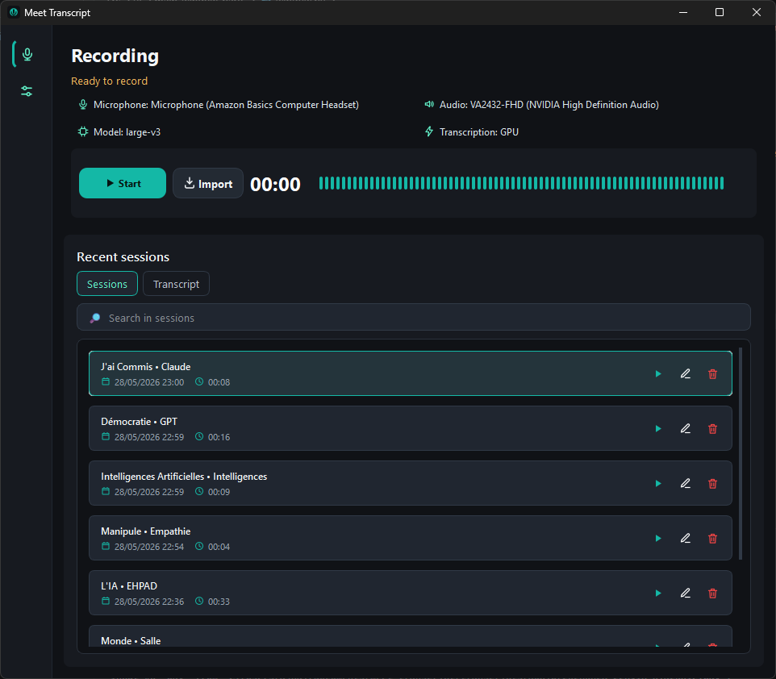

# Meet Transcript

[](https://github.com/hajdaini/meet-transcript/releases/latest)
[](https://github.com/hajdaini/meet-transcript/releases/latest/download/MeetTranscript-Windows-latest.zip)
[](https://github.com/hajdaini/meet-transcript/actions/workflows/ci.yml)
[](https://github.com/hajdaini/meet-transcript/actions/workflows/release.yml)


Meet Transcript is a Windows desktop app built with Python and PySide6. It records microphone audio and Windows system audio, imports existing audio files, then generates local meeting transcripts with faster-whisper.



## Current Features

- Modern compact dark PySide6 interface
- Microphone recording
- Windows system audio recording
- Optional microphone disable mode for system-audio-only recording
- WASAPI loopback capture for meeting audio
- Start / Stop recording workflow
- Import audio files directly from the app
- Drag & drop audio files into the app
- Supported import formats: `.wav`, `.mp3`, `.m4a`, `.flac`, `.ogg`, `.aac`, `.wma`
- Live compact waveform based on microphone and system audio levels
- Local faster-whisper transcription
- GPU or CPU transcription mode
- GPU readiness check from the app
- Whisper model selection: `small`, `medium`, `large-v3`
- Automatic Whisper language detection
- Real transcription progress from faster-whisper internal progress
- Smart transcript formatting with timestamped sections
- Configurable transcript section rules:
  - pause threshold
  - maximum section duration
  - maximum words per section
- Transcript stats:
  - word count
  - words per minute
- Desktop notifications when transcription completes or fails
- Recent sessions list with compact metadata
- Session search by title, transcript, date, or language
- Automatic session title generation with YAKE
- Duplicate title protection with suffixes like `(2)`, `(3)`
- Session actions:
  - play / pause audio inside the app
  - rename
  - delete
- Built-in audio player inside the transcript tab
- Transcript preview with copy action
- TXT transcript export
- Automatic settings save
- Configurable output folder
- Microphone gain calibration
- No-wheel settings inputs to prevent accidental changes while scrolling
- Interface language setting: English or French
- Compact single-column layout optimized for small windows

## Run The App

You can run Meet Transcript in two ways:

- from source with the local Python environment
- from the Windows release executable

## From Source

Create the local virtual environment:

```powershell
python -m venv .venv
```

Install dependencies inside the project environment:

```powershell
.\.venv\Scripts\python.exe -m pip install -r requirements.txt
```

Run the app:

```powershell
.\run.ps1
```

`run.ps1` prepares CUDA/cuDNN DLL paths and starts the app. Model, device, interface language, microphone, gain, transcript section settings, and output settings are managed directly inside the UI.

## From Windows Release

The repository includes a GitHub Actions workflow at `.github/workflows/release.yml`.

Download the latest Windows executable:

[Download Meet Transcript for Windows](https://github.com/hajdaini/meet-transcript/releases/latest/download/MeetTranscript-Windows-latest.zip)

Create and push a version tag to publish a GitHub release:

```powershell
git tag v1.0.0
git push origin v1.0.0
```

The workflow builds the Windows app with PyInstaller and uploads:

```text
MeetTranscript-Windows-v1.0.0.zip
MeetTranscript-Windows-latest.zip
```

Inside the archive, launch:

```text
MeetTranscript.exe
```

The release is published automatically on GitHub with generated release notes.

## Default Settings

```text
model: medium
device: GPU
compute type: int8_float16
interface language: English
transcription language detection: Auto
microphone: Auto
microphone gain: 1.8x
system output: Auto
output directory: transcripts/
smart section pause threshold: 1.8s
smart section max duration: 45s
smart section max words: 90
```

Settings are saved automatically in `settings.json`.

## Audio Import

Use the `Import` button to transcribe an existing audio file.

Supported formats:

```text
.wav
.mp3
.m4a
.flac
.ogg
.aac
.wma
```

You can also drag and drop one supported audio file directly into the app window. The app copies the file into the selected output folder, transcribes it, and adds it to the recent sessions list.

## Transcript Formatting

Meet Transcript uses faster-whisper timestamps and a lightweight formatter to create readable transcript sections.

Default section rules:

```text
new section after pause: 1.8s
maximum section duration: 45s
maximum section words: 90
```

The formatter also detects simple transition words to make sections more natural, without requiring a local LLM or external API.

## Automatic Titles

Meet Transcript can generate session titles automatically from the transcript using YAKE.

This is lightweight and runs locally:

```text
no GPU
no LLM
no API key
no model download
```

If title generation fails, the app falls back to standard session names.

## GPU Setup

GPU transcription uses `faster-whisper` through CTranslate2. On Windows, the app expects:

- NVIDIA driver
- CUDA Toolkit 12.x
- cuDNN 9 for CUDA 12

Recommended installed paths:

```text
C:\Program Files\NVIDIA GPU Computing Toolkit\CUDA\v12.8
C:\Program Files\NVIDIA\CUDNN\v9.22
```

Download pages:

- CUDA Toolkit archive: https://developer.nvidia.com/cuda-toolkit-archive
- cuDNN downloads: https://developer.nvidia.com/cudnn-downloads

The app scans these locations:

```text
gpu-libs/
C:\Program Files\NVIDIA GPU Computing Toolkit\CUDA\v12.*\bin
C:\Program Files\NVIDIA\CUDNN\v9*\**\cudnn*_9.dll
```

Expected DLLs include:

```text
cublas64_12.dll
cudnn_ops64_9.dll
```

Use `Settings > Verify GPU` to check the runtime. The app shows a notification or dialog when GPU is ready, or when a required dependency is missing.

## Storage

Generated files are stored under the selected output folder:

```text
transcripts/
  audio/
    Session audio files
  text/
    Transcript files as .txt
  history.json
```

The app stores session metadata in `history.json`. Deleting a session from the app also removes its audio and transcript files.

## Runtime Notes

- The first Whisper run downloads the selected model to the Hugging Face cache.
- The Hugging Face symlink warning on Windows is not blocking; it only means the cache may use more disk space.
- `medium` is the default model for speed and accuracy balance.
- `large-v3` is available for better accuracy.
- GPU mode uses `int8_float16` by default.
- CPU mode uses `int8`.
- Whisper language detection is automatic.
- The app interface can be switched between English and French.
- The progress bar updates from faster-whisper internal progress.
- CUDA/cuDNN can be installed manually or bundled separately in a GPU-specific release.
